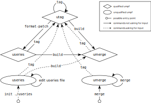

Getting Started
===============

For illustration, let's say we have two topic branches which we want to merge
into a release::

    ~/linux (master) $  git log --graph --oneline v5.0^..v5.0/topic/fixes v5.0^..v5.0/topic/more-fixes

    * 157d32af15330 (HEAD -> v5.0/topic/more-fixes) fix: newer gcc need explicit stdio.h include
    * d923fd6c8a01a fix compilation with gcc-8
    | * 1ad3cc4c7d974 (v5.0/topic/fixes) drivers: add support for tertiary frobnicated flectrospector
    | * 77009bb7be0c9 drivers: net: refactor variable names
    |/
    * 1c163f4c7b3f6 (tag: v5.0) Linux 5.0

We can get to a release tag in two ways: via a *useries* file or via
*umerges*. The way you choose depends on your usual workflow;

* A BSP developer who is used to work with patch series will likely choose the
  *useries* way to start an umpf.
* An upstream developer who is used to work with git merges will likely find
  themselves more comfortable with a *umerge*.

But note that both ways will get you an equivalent result.

Starting with a *useries*
-------------------------

We start by creating a *useries* file with umpf which describes the name of our
umpf, and the branches we want to merge together. This can be done with
``umpf init``, an interactive command that will prompt for all the
necessary information::

    ~/linux (master) $  umpf init useries

    base: v5.0
    name: 5.0/special-customer-release
    topic: v5.0/topic/fixes
    topic: v5.0/topic/more-fixes
    topic:

- *base* specifies the commitish you want all your branches to be based on.
  This will most likely be an upstream release tag, so we use ``v5.0`` here.
- *name* is the name of the umpf, which will be used for umpf tags. Make sure
  it doesn't conflict with any tags or branches in the repository - especially
  the umpf name cannot start with an already existing ref! That is why we use
  ``5.0/…`` here instead of ``v5.0/…``.
- *topic* specifies the branches to merge, one by line. End with an empty line.
  For illustration, we merge two branches with random fixes, which we already
  have created before on top of our base commit.
  In reality, these will most probably be independent (possibly long-lived)
  feature branches which you want to merge into a release.
  It is not important that the branches start at the base, but they should be
  mergeable without conflicts. [#without-conflicts]_

.. [#without-conflicts] unless you really like solving conflicts during merges…

umpf now created the file *useries*, as specified on the command line, and
filled it with the information we fed it::

    ~/linux (master) $  cat useries

    # umpf-base: v5.0
    # umpf-name: 5.0/special-customer-release
    # umpf-topic: v5.0/topic/fixes
    # umpf-topic: v5.0/topic/more-fixes
    # umpf-end

If you ever want to merge additional branches for the release, add them to the
file as new ``umpf-topic:`` lines before ``umpf-end``.

This form of plain *useries* is an unqualified form of umpf,
and we need to transform it into another form to make it qualified.

Why is this form of *useries* unqualified?
~~~~~~~~~~~~~~~~~~~~~~~~~~~~~~~~~~~~~~~~~~

Suppose you want to create a patch stack from the above *useries* file.
Creating a patch stack is done with umpf's *format-patch* command.
But when you try that on your file…

::

  ~/linux ((v5.0)) $  umpf format-patch ./useries

  umpf: Cannot run 'format_patch' without a 'topic-range' for each 'topic'! Maybe you need to 'tag' first?

… umpf refuses to work with it.

To create a linear patch stack, umpf needs to know two things:

1. how to put the commits from your referenced branches into a linear order,
2. and how to call the result

Often the first part is more difficult than the second,
as it includes solving possible conflicts between the topic branches.
Therefore we must first preprocess our *useries* into a form that
contains information about the linear commits.

Transforming a *useries* into a *umerge*
~~~~~~~~~~~~~~~~~~~~~~~~~~~~~~~~~~~~~~~~

From this *useries* file, we can now build a *umerge*::

    ~/linux (master) $  umpf build ./useries

    umpf: Remote undefined. Choose the branch with the correct remote:
    0) v5.0/topic/fixes
    branch number: 0
    umpf: Using remote 'refs/heads/'.
    umpf: merging 'v5.0/topic/fixes'...
    Merge made by the 'recursive' strategy.
     drivers/Kconfig          |  2 ++
     drivers/Makefile         |  2 ++
     drivers/frob/Kconfig     |  5 +++++
     drivers/frob/Makefile    |  3 +++
     drivers/net/virtio_net.c | 48 ++++++++++++++++++++++++------------------------
     5 files changed, 36 insertions(+), 24 deletions(-)
     create mode 100644 drivers/frob/Kconfig
     create mode 100644 drivers/frob/Makefile
    umpf: merging 'v5.0/topic/more-fixes'...
    Merge made by the 'recursive' strategy.
     include/net/ip.h | 7 +++++++
     1 file changed, 7 insertions(+)

umpf first asks us which remote we want to use to resolve the topic branch
names specified in the *useries* file.
We assume that we haven't pushed the branches to a remote yet,
and we choose the default (our local repository).

::

    ~/linux ((b1e3a4169267a...)) $  git log --graph --oneline v5.0^..

    *   b1e3a4169267a (HEAD) Merge 'v5.0/topic/more-fixes' into 5.0/special-customer-release
    |\
    | * 157d32af15330 (v5.0/topic/more-fixes) fix: newer gcc need explicit stdio.h include
    | * d923fd6c8a01a fix compilation with gcc-8
    * |   600966fede13d Merge 'v5.0/topic/fixes' into 5.0/special-customer-release
    |\ \
    | |/
    |/|
    | * 1ad3cc4c7d974 (v5.0/topic/fixes) drivers: add support for tertiary frobnicated flectrospector
    | * 77009bb7be0c9 drivers: net: refactor variable names
    |/
    * 1c163f4c7b3f6 (tag: v5.0) Linux 5.0

After umpf has finished, we can see that all our topic branches have been
merged in the order they were specified.
You can now give that *umerge* a branch name (``git checkout -b <name>``) and use
it to develop on top of both feature branches.
If you commit your results and want to have them applied to one of your merged
feature branches, use ``umpf distribute``.

If you inspect the merge commit, you see that this type of *umerge* is fully
qualified since umpf has saved the info from the *useries* file::

     ~/linux ((b1e3a4169267a...)) $  git show --notes

     commit b1e3a4169267af89533f2105de69e673c94a80e0 (HEAD)
     Merge: 600966fede13d 157d32af15330
     Author: Your Name <yna@example.org>
     Date:   2019-03-11 15:35:45

             Merge 'v5.0/topic/more-fixes' into 5.0/special-customer-release

             umpf-merge-topic: v5.0/topic/more-fixes

     Notes:
             umpf-build-note: v5.0 5.0/special-customer-release

Therefore we can directly use that *umerge* to build a *utag* – see below.

Starting with a *umerge*
------------------------

Based on the state of our two example topic branches, we can also create a
*umerge* directly without the need for a temporary *useries* file.
For that, we first check out the tag which we want to use as 'base',
and then *umerge* our two topic branches::

    ~/linux (master) $  git checkout v5.0

    ~/linux ((v5.0)) $  umpf merge v5.0/topic/fixes

    umpf: merging 'v5.0/topic/fixes'...
    Merge made by the 'recursive' strategy.
     drivers/Kconfig          |  2 ++
     drivers/Makefile         |  2 ++
     drivers/frob/Kconfig     |  5 +++++
     drivers/frob/Makefile    |  3 +++
     drivers/net/virtio_net.c | 48 ++++++++++++++++++++++++------------------------
     5 files changed, 36 insertions(+), 24 deletions(-)
     create mode 100644 drivers/frob/Kconfig
     create mode 100644 drivers/frob/Makefile

    ~/linux ((e92a0fbd2661a...)) $  umpf merge v5.0/topic/more-fixes

    umpf: merging 'v5.0/topic/more-fixes'...
    Merge made by the 'recursive' strategy.
     include/net/ip.h | 7 +++++++
     1 file changed, 7 insertions(+)

.. note::

   If the merge failed then you probably don't have a local branch
   with that name yet, and intended to merge a remote branch.
   ``umpf merge`` works like ``git merge``, that is, you give it a commit-ish
   which it should merge.
   But when merging, umpf needs to determine the name of the topic branch,
   so in that case you have to tell it what the name of the remote is,
   so umpf can strip it from the branch name::

     $  umpf merge --remote=origin origin/v5.0/topic/more-fixes

   If you often merge remote branches from the same remote,
   you can configure the default remote in the git config,
   and leave out the ``--remote=`` argument::

     $  git config umpf.fallback-remote origin

By inspecting the merge commits, you see that umpf has recorded additional info
in the commit message::

    ~/linux ((7220a1f96a989...)) $  git show

    commit 7220a1f96a9895e6942a753bdf1ab6f375d2fc19 (HEAD)
    Merge: e92a0fbd2661a 157d32af15330
    Author: Your Name <yna@example.org>
    Date:   2019-03-11 15:42:56

        Merge 'v5.0/topic/more-fixes'

        umpf-merge-topic: v5.0/topic/more-fixes

Now you can work on top of both branches and develop patches locally. When you
have finished, use ``umpf distribute`` like described above.

Building a *utag*
-----------------

umpf can build a *utag* from a *umerge* or from a *useries*.

From a *useries*
~~~~~~~~~~~~~~~~

If we want to build a release tag from a useries file, we use
``umpf tag`` on the useries file::

    ~/linux (master) $  umpf tag ./useries

    # umpf-base: v5.0
    # umpf-name: 5.0/special-customer-release
    # umpf-version: 5.0/special-customer-release/20190311-1
    umpf: Remote undefined. Choose the branch with the correct remote:
    0) v5.0/topic/fixes
    branch number: 0
    umpf: Using remote 'refs/heads/'.
    # umpf-topic: v5.0/topic/fixes
    # umpf-hashinfo: 1ad3cc4c7d974311f5f5a2e55d69be15fdf917cd
    # umpf-topic-range: 1c163f4c7b3f621efff9b28a47abb36f7378d783..1ad3cc4c7d974311f5f5a2e55d69be15fdf917cd
    # umpf-topic: v5.0/topic/more-fixes
    # umpf-hashinfo: 157d32af153309246d7cc8a4f283299d751d6077
    # umpf-topic-range: 1ad3cc4c7d974311f5f5a2e55d69be15fdf917cd..8bae5bbec8cb4599c141405e9755b7c0e42e064f
    [detached HEAD 19cdc2b857e6] Release 5.0/special-customer-release/20190311-1
     1 file changed, 1 insertion(+), 1 deletion(-)
    # umpf-release: 5.0/special-customer-release/20190311-1
    # umpf-topic-range: 8bae5bbec8cb4599c141405e9755b7c0e42e064f..19cdc2b857e662a38c712b41ce610000a5ddc6ae
    # umpf-end

    ~/linux ((5.0/special-customer-release/20190311-1)) $  git log --graph --oneline v5.0^..

    *-.   7c8644d422d89 (HEAD, tag: 5.0/special-customer-release/20190311-1) 5.0/special-customer-release/20190311-1
    |\ \
    | | * 157d32af15330 (v5.0/topic/more-fixes) fix: newer gcc need explicit stdio.h include
    | | * d923fd6c8a01a fix compilation with gcc-8
    * | | 19cdc2b857e66 (tag: 5.0/special-customer-release/20190311-1-flat) Release 5.0/special-customer-release/20190311-1
    * | | 8bae5bbec8cb4 fix: newer gcc need explicit stdio.h include
    * | | f521683d6a26c fix compilation with gcc-8
    |/ /
    * | 1ad3cc4c7d974 (v5.0/topic/fixes) drivers: add support for tertiary frobnicated flectrospector
    * | 77009bb7be0c9 drivers: net: refactor variable names
    |/
    * 1c163f4c7b3f6 (tag: v5.0) Linux 5.0

The commit graph now looks a bit more complex: umpf rebases the topic branches
on top of each other in the order the were specified, then creates an octopus
merge commit, and tags that commit with a auto-generated release tag
(``5.0/special-customer-release/20190311-1`` in our case).
The octopus merge records the state of the branches at the time when the *utag*
was built, which makes it possible to build the *umerge* later from the *utag* and
use the identical git commits.
The linear rebase of topic branches onto each other (the ``-flat`` tag) is
important when you want to build a useries back from a *utag* – see below.

From a *umerge*
~~~~~~~~~~~~~~~

In order to build a *utag* from a *umerge*, you first have to answer
questions about the *base* and the *name* of your tag,
since those information was not specified before,
and umpf cannot infer it automatically::

    ~/linux ((7220a1f96a989...)) $  umpf tag

    umpf: Creating series from merges...
    base: v5.0
    name: 5.0/special-customer-release
    # umpf-base: v5.0
    # umpf-name: 5.0/special-customer-release
    # umpf-version: 5.0/special-customer-release/20190311-1
    umpf: Remote undefined. Choose the branch with the correct remote:
    0) v5.0/topic/fixes
    branch number: 0
    umpf: Using remote 'refs/heads/'.
    # umpf-topic: v5.0/topic/fixes
    # umpf-hashinfo: 1ad3cc4c7d974311f5f5a2e55d69be15fdf917cd
    # umpf-topic-range: 1c163f4c7b3f621efff9b28a47abb36f7378d783..1ad3cc4c7d974311f5f5a2e55d69be15fdf917cd
    # umpf-topic: v5.0/topic/more-fixes
    # umpf-hashinfo: 157d32af153309246d7cc8a4f283299d751d6077
    # umpf-topic-range: 1ad3cc4c7d974311f5f5a2e55d69be15fdf917cd..985777b8d1e60d50dbccadee821c6c279ca7e468
    [detached HEAD 29e7588b6136] Release 5.0/special-customer-release/20190311-1
     1 file changed, 1 insertion(+), 1 deletion(-)
    # umpf-release: 5.0/special-customer-release/20190311-1
    # umpf-topic-range: 985777b8d1e60d50dbccadee821c6c279ca7e468..29e7588b6136a81133dad1873c196d0e77ff34d9
    # umpf-end

The *utag* now contains all the info for a fully qualified umpf::

    ~/linux ((5.0/special-customer-release/20190311-1))  $ git show

    commit d4c8d4fee0d9594e91a51f0b85f4e97f461c5d77 (HEAD, tag: 5.0/special-customer-release/20190311-1)
    Merge: 29e7588b6136a 1ad3cc4c7d974 157d32af15330
    Author: Your Name <yna@example.org>
    Date:   2019-03-11 15:49:20

        5.0/special-customer-release/20190311-1

        # umpf-base: v5.0
        # umpf-name: 5.0/special-customer-release
        # umpf-version: 5.0/special-customer-release/20190311-1
        # umpf-topic: v5.0/topic/fixes
        # umpf-hashinfo: 1ad3cc4c7d974311f5f5a2e55d69be15fdf917cd
        # umpf-topic-range: 1c163f4c7b3f621efff9b28a47abb36f7378d783..1ad3cc4c7d974311f5f5a2e55d69be15fdf917cd
        # umpf-topic: v5.0/topic/more-fixes
        # umpf-hashinfo: 157d32af153309246d7cc8a4f283299d751d6077
        # umpf-topic-range: 1ad3cc4c7d974311f5f5a2e55d69be15fdf917cd..985777b8d1e60d50dbccadee821c6c279ca7e468
        # umpf-release: 5.0/special-customer-release/20190311-1
        # umpf-topic-range: 985777b8d1e60d50dbccadee821c6c279ca7e468..29e7588b6136a81133dad1873c196d0e77ff34d9
        # umpf-end

Building a *useries*
--------------------

This is now easy, as a *utag* is fully qualified,
and already contains the linear series in its first parent.
Just do an ``umpf format-patch`` on the *utag*::

   ~/linux ((5.0/special-customer-release/20190311-1)) $  umpf format-patch -p ../my-bsp/patches/linux-5.0/

   umpf: Using series from commit message...
   # umpf-base: v5.0
   # umpf-name: 5.0/special-customer-release
   # umpf-version: 5.0/special-customer-release/20190311-1
   # umpf-topic: v5.0/topic/fixes
   # umpf-hashinfo: 1ad3cc4c7d974311f5f5a2e55d69be15fdf917cd
   # umpf-topic-range: 1c163f4c7b3f621efff9b28a47abb36f7378d783..1ad3cc4c7d974311f5f5a2e55d69be15fdf917cd
   0001-drivers-net-refactor-variable-names.patch
   0002-drivers-add-support-for-tertiary-frobnicated-flectro.patch
   # umpf-topic: v5.0/topic/more-fixes
   # umpf-hashinfo: 157d32af153309246d7cc8a4f283299d751d6077
   # umpf-topic-range: 1ad3cc4c7d974311f5f5a2e55d69be15fdf917cd..8bae5bbec8cb4599c141405e9755b7c0e42e064f
   0101-fix-compilation-with-gcc-8.patch
   0102-fix-newer-gcc-need-explicit-stdio.h-include.patch
   # umpf-release: 5.0/special-customer-release/20190311-1
   # umpf-topic-range: 8bae5bbec8cb4599c141405e9755b7c0e42e064f..19cdc2b857e662a38c712b41ce610000a5ddc6ae
   0201-Release-5.0-special-customer-release-20190311-1.patch
   # umpf-end

   ~/linux ((5.0/special-customer-release/20190311-1))  $ ls -l ../my-bsp/patches/linux-5.0/

   total 28
   -rw-r--r-- 1 yna users 6480 Jun  4 18:06 0001-drivers-net-refactor-variable-names.patch
   -rw-r--r-- 1 yna users 1609 Jun  4 18:06 0002-drivers-add-support-for-tertiary-frobnicated-flectro.patch
   -rw-r--r-- 1 yna users  528 Jun  4 18:06 0101-fix-compilation-with-gcc-8.patch
   -rw-r--r-- 1 yna users  485 Jun  4 18:06 0102-fix-newer-gcc-need-explicit-stdio.h-include.patch
   -rw-r--r-- 1 yna users  462 Jun  4 18:06 0201-Release-5.0-special-customer-release-20190311-1.patch
   -rw-r--r-- 1 yna users  938 Jun  4 18:06 series

The ``series`` file in that repository is now a fully qualified useries,
and can be used to recreate the *utag* in Git.

Updating an *utag*
------------------

Using the metadata from an already existing tag - ``5.0/special-customer-release/190311-1`` for example -
umpf can be instructed to create a fresh *utag* based on the previous metadata::

   ~/linux ((5.0/special-customer-release/20190311-1)) $  umpf tag 5.0/special-customer-release/190311-1

    # umpf-base: v5.0
    # umpf-name: 5.0/special-customer-release
    # umpf-version: 5.0/special-customer-release/20230309-1
    umpf: Remote undefined. Choose the branch with the correct remote:
    0) v5.0/topic/fixes
    branch number: 0
    umpf: Using remote 'refs/heads/'.
    # umpf-topic: v5.0/topic/fixes
    # umpf-hashinfo: 1ad3cc4c7d974311f5f5a2e55d69be15fdf917cd
    # umpf-topic-range: 1c163f4c7b3f621efff9b28a47abb36f7378d783..1ad3cc4c7d974311f5f5a2e55d69be15fdf917cd
    # umpf-topic: v5.0/topic/more-fixes
    # umpf-hashinfo: 157d32af153309246d7cc8a4f283299d751d6077
    # umpf-topic-range: 1ad3cc4c7d974311f5f5a2e55d69be15fdf917cd..8bae5bbec8cb4599c141405e9755b7c0e42e064f
    [detached HEAD 0b1994336c1a] Release 5.0/special-customer-release/20190311-1
     1 file changed, 1 insertion(+), 1 deletion(-)
    # umpf-release: 5.0/special-customer-release/20230309-1
    # umpf-topic-range: 8bae5bbec8cb4599c141405e9755b7c0e42e064f..19cdc2b857e662a38c712b41ce610000a5ddc6ae
    # umpf-end

Or tell umpf to rebase onto a new *umpf-base* when creating a fresh *utag*::

   ~/linux ((5.0/special-customer-release/20190311-1)) $  umpf tag --base=v5.0.42 --version=2 5.0/special-customer-release/190311-1

    # umpf-base: v5.0.42
    # umpf-name: 5.0/special-customer-release
    # umpf-version: 5.0/special-customer-release/20230309-2
    umpf: Remote undefined. Choose the branch with the correct remote:
    0) v5.0/topic/fixes
    branch number: 0
    umpf: Using remote 'refs/heads/'.
    # umpf-topic: v5.0/topic/fixes
    # umpf-hashinfo: 1ad3cc4c7d974311f5f5a2e55d69be15fdf917cd
    # umpf-topic-range: 1c163f4c7b3f621efff9b28a47abb36f7378d783..1ad3cc4c7d974311f5f5a2e55d69be15fdf917cd
    # umpf-topic: v5.0/topic/more-fixes
    # umpf-hashinfo: 157d32af153309246d7cc8a4f283299d751d6077
    # umpf-topic-range: 1ad3cc4c7d974311f5f5a2e55d69be15fdf917cd..8bae5bbec8cb4599c141405e9755b7c0e42e064f
    [detached HEAD e865032e1b9b] Release 5.0/special-customer-release/20190311-2
     1 file changed, 1 insertion(+), 1 deletion(-)
    # umpf-release: 5.0/special-customer-release/20230309-2
    # umpf-topic-range: 8bae5bbec8cb4599c141405e9755b7c0e42e064f..19cdc2b857e662a38c712b41ce610000a5ddc6ae
    # umpf-end

Synchronizing umpf topic branch
-------------------------------

Due to Git's distributed nature, checked out topic branches can get
out-of-sync. To compare local topic branches against those referenced
in a *utag*, ``umpf pull`` can be used::

  umpf pull --dry-run 5.0/special-customer-release/20190311-1
  umpf: Using series from commit message...
   * [new branch]                02fb74aa381080855a57080138b29ecc96586788 -> v5.0/topic/most-fixes
   ! [rejected]                  f0693b782dd026f2adc4d3c336d9ac6dfb352a73 -> v5.0/topic/more-fixes  (non-fast-forward)

Following options are supported:

- ``--dry-run``: compare the branches, but stop short of actually updating
                 them
- ``--force``: reset local branches that are not checked-out to the
               ``umpf-hashinfo`` in the ``utag``
- ``--update``: only update existing branches

The counterpart to publish topic branches to a remote after creating a new
``utag`` is ``umpf push``:

  umpf --dry-run --remote=downstream push 5.0/special-customer-release/20190311-1
  umpf: Using series from commit message...
  To ssh://downstream
   * [new branch]                          02fb74aa381080855a57080138b29ecc96586788 -> v5.0/topic/most-fixes
   ! [rejected]                            f0693b782dd026f2adc4d3c336d9ac6dfb352a73 -> v5.0/topic/more-fixes  (non-fast-forward)
  error: failed to push some refs to 'ssh:/downstream'

It supports the same options as ``umpf pull``, but instead of doing local
changes, it operates on the specified remote.

``umpf push`` is especially useful when multiple developers are creating
`utags` for the same project in parallel. Each developer will initially
only push their `utag` to the common repository. Once the changes
introduced by a `utag` are accepted, all topic branches can be force
updated on the remote to this most recent `utag`, possibly via
a server-side pull-request post-merge hook running, e.g.::

  umpf push --remote=downstream --force .../linux/patches/series.inc

Overview
--------

Finally here is an overview of *utags*, *umerges*, *useries* and how to get from one
to another:

